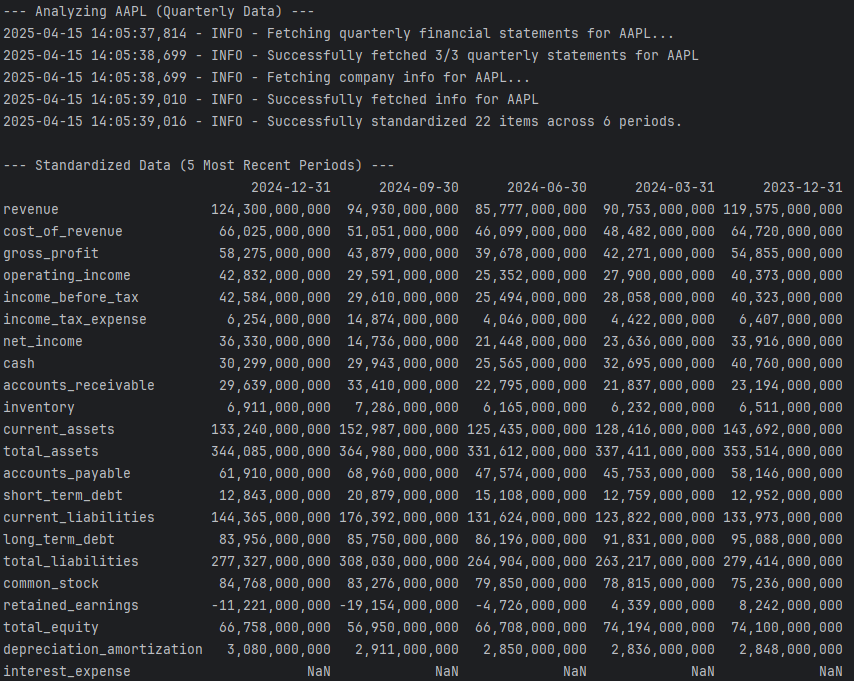
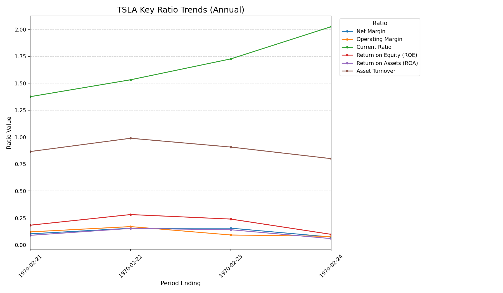
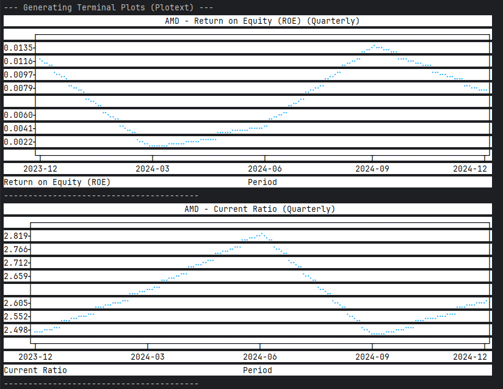

# Financial Analysis CLI

A powerful command-line interface tool built with Python for fetching, analyzing, and visualizing financial data for individual companies or comparing companies within sectors using data primarily sourced from Yahoo Finance.


## Features

* **Data Extraction:** Fetch annual/quarterly Income Statements, Balance Sheets, and Cash Flow statements from Yahoo Finance
* **Company Information:** Retrieve general company details including name, sector, industry, and website
* **Data Standardization:** Map inconsistent financial item names into a standardized internal format
* **Data Verification:** Perform basic accounting consistency checks (e.g., Balance Sheet Equation)
* **Ratio Calculation:**
  * Calculate key historical financial ratios (Profitability, Liquidity, Leverage, Activity, Return)
  * Calculate single-period ratios for sector comparison
  * Calculate aggregate sector statistics (Average, Median, Min, Max)
* **Visualization:**
  * Generate graphical trend plots using Matplotlib (saves as PNG)
  * Display simple trend plots directly in the terminal using Plotext
* **Sector Analysis:** Compare financial ratios of companies within specific sectors
* **Customizable Output:** Control periods displayed, choose data frequency, specify output directories

## Installation

### Prerequisites
* Python 3.8 or higher
* pip (Python package installer)

### Setup

1. **Clone the repository:**
   ```bash
   git clone https://github.com/JASHWANTHS07/FinancialAnalyzerCLI
   cd financial-analysis-cli
   ```

2. **Create a virtual environment (recommended):**
   ```bash
   # Windows
   python -m venv venv
   .\venv\Scripts\activate

   # macOS / Linux
   python3 -m venv venv
   source venv/bin/activate
   ```

3. **Install dependencies:**
   ```bash
   pip install -r requirements.txt
   ```
   
   > Note: `matplotlib` and `plotext` are optional. If you don't need plotting features, you can remove them from `requirements.txt` before installing.

## Usage

### Analyze a Single Company

```bash
python main.py analyze-company <TICKER> [OPTIONS]
```

**Arguments:**
- `<TICKER>`: (Required) Stock ticker symbol (e.g., AAPL, MSFT)

**Options:**
- `--period [annual|quarterly]`: Specify data frequency (default: annual)
- `--years INTEGER`: Number of recent periods to display (default: 5)
- `--plot`: Generate and save graphical plots for key ratio trends
- `--term-plot`: Display simple trend plots directly in the terminal
- `--output-dir PATH`: Directory to save generated plots (default: output)
- `--show`: Attempt to automatically open the generated plots

**Examples:**
```bash
# Analyze Apple's annual data for the last 5 years with plots
python main.py analyze-company AAPL --period annual --years 5 --plot --output-dir ./financial_charts

# Analyze Microsoft's quarterly data for 8 quarters with terminal plots
python main.py analyze-company MSFT --period quarterly --years 8 --term-plot
```


### Analyze a Sector

```bash
python main.py analyze-sector <SECTOR_NAME> [OPTIONS]
```

**Arguments:**
- `<SECTOR_NAME>`: (Required) The sector to analyze (must match a sector in mapping file)

**Options:**
- `--map-file PATH`: Path to CSV file mapping tickers to sectors (default: data/ticker_sector_map.csv)
- `--period [annual|quarterly]`: Data frequency to analyze (default: annual)

**Prerequisites:**
A CSV file with ticker-sector mappings with this format:
```csv
Ticker,Sector,Industry,Name
AAPL,Technology,Consumer Electronics,Apple Inc.
MSFT,Technology,Software - Infrastructure,Microsoft Corporation
GOOGL,Communication Services,Internet Content & Information,Alphabet Inc.
```

**Examples:**
```bash
# Analyze the Technology sector using default map file and annual data
python main.py analyze-sector Technology

# Analyze Healthcare sector with custom mapping and quarterly data
python main.py analyze-sector Healthcare --map-file config/my_sector_map.csv --period quarterly
```

## Project Structure

```
.
├── data/
│   └── ticker_sector_map.csv   # Example mapping file (needs to be created)
├── output/                     # Default directory for saving plots
├── src/
│   ├── analysis/
│   │   ├── __init__.py
│   │   ├── ratios.py           # Ratio calculation logic
│   │   └── verifier.py         # Data consistency checks
│   ├── data_extraction/
│   │   ├── __init__.py
│   │   ├── extractor.py        # Data fetching from yfinance
│   │   └── mapper.py           # Standardizing financial item names
│   ├── utils/
│   │   ├── __init__.py
│   │   ├── constants.py        # Contains FINANCIAL_ITEM_MAPPING
│   │   └── helpers.py          # Utility functions
│   └── __init__.py
├── main.py                     # Main CLI script using Click
├── requirements.txt            # Project dependencies
└── README.md                   # This file
```

## Core Components

### Data Extraction
The tool uses `yfinance` to fetch financial statements and company information from Yahoo Finance. Data can be retrieved in either annual or quarterly frequency.

### Standardization
Raw financial items from Yahoo Finance are mapped to a standardized internal format using predefined mappings, ensuring consistent calculations across different companies and data sources.

### Financial Ratio Analysis
The tool calculates key financial ratios across multiple categories:
- **Profitability:** Gross Margin, Operating Margin, Net Margin, ROE, ROA
- **Liquidity:** Current Ratio, Quick Ratio, Cash Ratio
- **Leverage:** Debt-to-Equity, Interest Coverage, Debt-to-Assets
- **Activity:** Asset Turnover, Inventory Turnover
- **Return:** Return on Assets, Return on Equity, Return on Invested Capital

### Verification
Basic accounting consistency checks ensure data quality:
- Balance Sheet Equation (Assets ≈ Liabilities + Equity)
- Cash Flow verification
- Income Statement consistency

### Visualization
Optional visualization features allow for:
- Saving ratio trend plots as PNG files using Matplotlib
- 
- Displaying simplified trend plots directly in the terminal using Plotext
- 

## Dependencies

- **Click**: Command-line interface creation
- **pandas**: Data manipulation and analysis
- **yfinance**: Financial data retrieval from Yahoo Finance
- **Matplotlib** (optional): For generating graphical plots
- **Plotext** (optional): For terminal-based plots

## Contributing

Contributions are welcome! Please feel free to submit a Pull Request.

## License

This project is licensed under the MIT License - see the LICENSE file for details.
